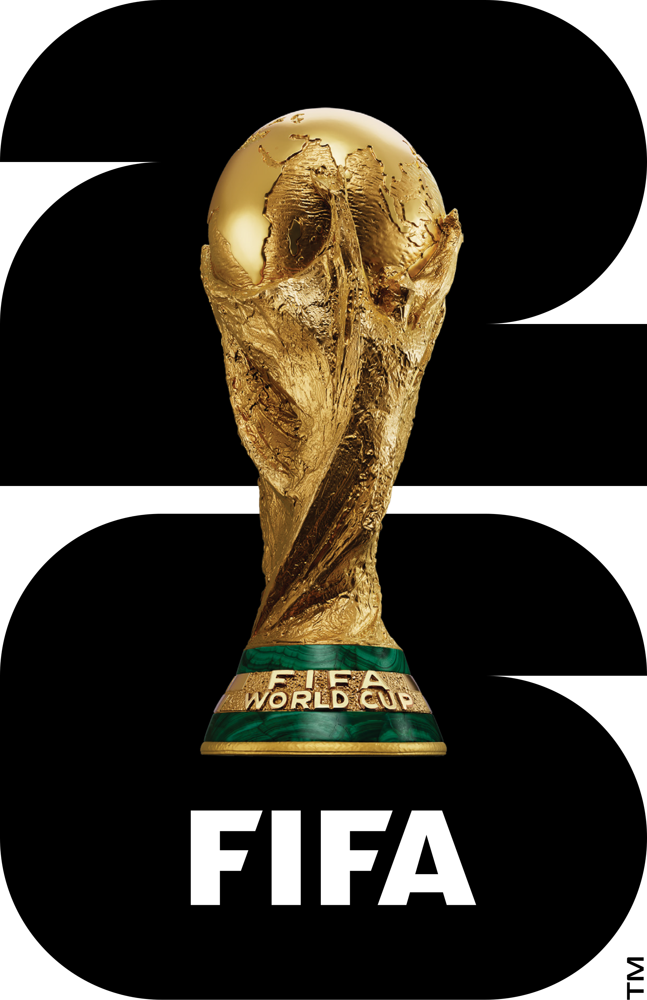

Projet Blue Lock

 

Ce site web fun et interactif vous permettra de suivre toutes les informations concernant la coupe du monde 2026.
Cette coupe du monde prend place dans 3 pays, les États-Unis, le Canada et le Mexique.

Fait par:
Achille LOUZOLO MATUMONA
Faouzi GUAAMRE
Mohammed-Amine FARNOUNE
